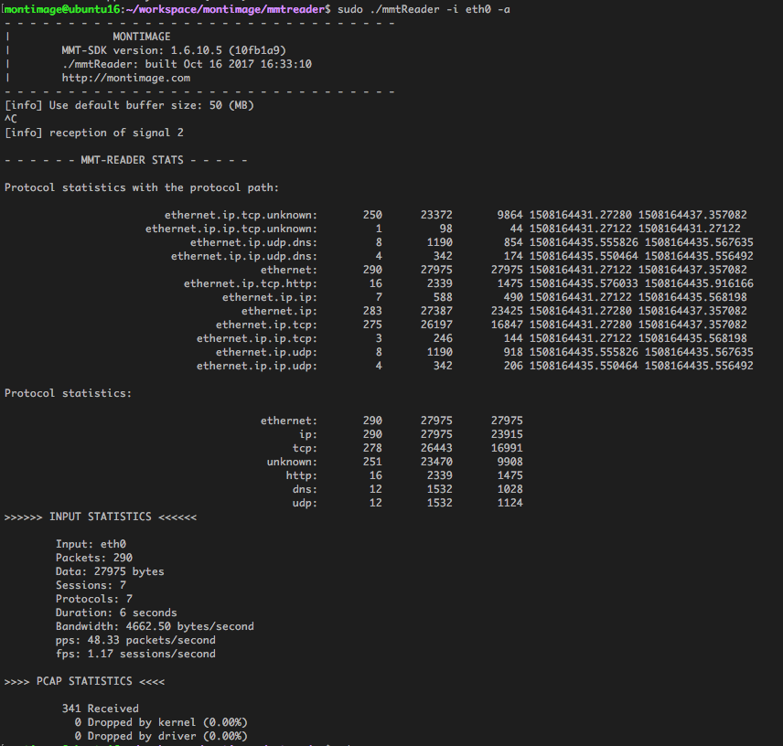

# MMTReader #

- Simple version of MMT Tool
- Provide network statistics informations
- OS supported: Linux

## Install

Make sure you have installed [`MMT-DPI`](https;//bitbucket.org/montimage/mmt-dpi)

### Install some dependencies

To compile MMTReader, we need to install `libpcap-dev` and `libconfuse-dev`:

_On Debian machine_

```
sudo -s
apt-get update
# C/C++ environment
apt-get install -y build-essential gcc g++ make
apt-get update
apt-get install libpcap-dev libconfuse-dev
```

_On Redhat machine_

```
yum update
# C/C++ environment
yum group install "Development Tools"
yum install libpcap-devel
```

## Compile *MMTReader*

To compile `MMTReader`:

```
gcc -g -o mmtReader mmtReader.c -I /opt/mmt/dpi/include -L /opt/mmt/dpi/lib -lmmt_core -ldl -lpcap
```

## Running *MMTReader*

 Usage:

```
./mmtReader -t [PATH_TO_PCAP_FILE] <OPTION>

sudo ./mmtReader -i [INTERFACE_NAME] <OPTION>
```
 
 Options:

     -b [value] : Set buffer for pcap handler in realtime monitoring

     -a         : Show protocol path

     -h         : Show help

## Issues

If you have any problem, please contact us at: [contact@montimage.com](contact@montimage.com)

## License 
Copyright [Montimage](http://montimage.com)