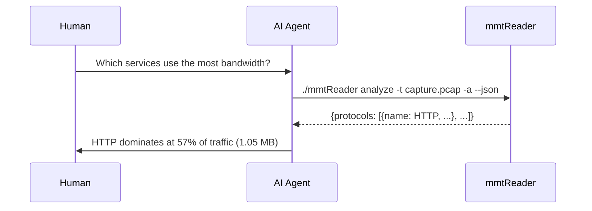

# Ask about network traffic. Get clear answers.

mmtReader is a deep packet inspection engine that AI Agents use to analyze network traffic and produce human-readable reports with visualizations.

[**Get Started ->**](#quick-start)

## How It Works

An AI Agent receives a natural language question about network traffic, runs mmtReader to inspect the packets, and returns a structured answer with visualizations.


```mermaid
flowchart LR
    A[Human question<br/>Which services are slow?] --> B[AI Agent]
    B --> C[mmtReader analyze<br/>-t capture.pcap -a]
    C --> D[Protocol stats<br/>Packet counts, bandwidth,<br/>sessions per protocol]
    D --> E[AI Agent]
    E --> F[Human answer<br/>Plain language + diagram]
```

The AI Agent handles the translation: raw protocol statistics become plain language with actionable insights.

## Agent Workflow


```mermaid
sequenceDiagram
    participant Human as Human
    participant Agent as AI Agent
    participant Reader as mmtReader
    
    Human->>Agent: Which services use the most bandwidth?
    Agent->>Reader: ./mmtReader analyze -t capture.pcap -a --json
    Reader-->>Agent: {protocols: [{name: HTTP, ...}, ...]}
    Agent->>Human: HTTP dominates at 57% of traffic (1.05 MB)
```

## Architecture

```
[pcap file / network interface]
        │
        ▼
  mmtReader.c (entry point)
  ├── pcap_open_offline() / capture_init()
        │
        ▼
  core/engine.c
  ├── engine_process_packet() — MMT-DPI classification + extraction
  ├── packet_handler() — update counters
  ├── new_ipv4_session_handler() — count sessions
  └── new_ipv6_session_handler() — count sessions
        │
        ▼
  core/engine.c (stats aggregation)
  ├── get_protocol_stats() — per-instance stats
  ├── proto_hierarchy_ids_to_str() — path formatting
  └── insert_proto_info() — sorted linked list
        │
        ▼
  cli/output.c
  ├── output_print_stats_ex() — format and print (TEXT or JSON)
  └── engine_print_pcap_stats() — drop counts
        │
        ▼
  engine_destroy() — cleanup resources
```

## Sample Output

**Raw mmtReader output (what the Agent receives):**

```
MMT-SDK 1.0.0 - Montimage
Build: Jul 22 2025 14:32:01

Protocol Statistics (with path):
  HTTP          :  1053 pkts,  1053910 data bytes,   453910 payload bytes
    TCP.HTTP    :  1053 pkts,  1053910 data bytes,   453910 payload bytes
  DNS           :   417 pkts,    31400 data bytes,     31400 payload bytes
    UDP.DNS     :   417 pkts,     31400 data bytes,      31400 payload bytes
  TLS           :   347 pkts,   101413 data bytes,    101413 payload bytes
    TCP.TLS     :   347 pkts,    101413 data bytes,     101413 payload bytes
  ICMP          :    44 pkts,     2752 data bytes,       2752 payload bytes
    ICMP        :    44 pkts,      2752 data bytes,        2752 payload bytes

Protocol Statistics:
  HTTP          :  1053 pkts,  1053910 data bytes,   453910 payload bytes
  DNS           :   417 pkts,    31400 data bytes,     31400 payload bytes
  TLS           :   347 pkts,   101413 data bytes,    101413 payload bytes
  ICMP          :    44 pkts,     2752 data bytes,       2752 payload bytes

Input Statistics:
  Packets      :  1861 packets
  Data Volume  :  1189475 bytes
  IPv4 Sessions:  142 sessions
  Protocols    :  4 protocols
  Duration     :  10.0 seconds
  Bandwidth    :  118947 bytes/sec
  PPS          :  186.1 packets/sec
```

**What the Agent tells the user:**

> "The capture contains 1,861 packets over 10 seconds (186 pps). HTTP is the dominant protocol with 1,053 packets (57% of traffic). DNS accounts for 417 packets, TLS for 347, and ICMP for 44. There are 142 IPv4 sessions across 4 protocols."

## Key Features

| Feature | What you get |
|---|---|
| Natural language interface | Ask questions in plain English |
| Protocol classification | Identify every protocol in the traffic |
| Visual output | Mermaid-ready stats for embedding |
| JSON output | Machine-readable for automation pipelines |
| Live or offline | Analyze pcap files or monitor live interfaces (Ethernet + WiFi) |
| Session tracking | Per-protocol IPv4/IPv6 session counts |

## Quick Start

Build mmtReader:

```bash
make build
```

Run a sample analysis:

```bash
./mmtReader analyze -t smallFlows.pcap -a
```

Install system-wide:

```bash
sudo ./install.sh
```

## Usage Examples

**Question:** "What protocols are in this capture?"

```bash
# Agent runs:
./mmtReader analyze -t capture.pcap -a
```

**Output the agent receives:**

```
Protocol Statistics (with path):
  HTTP          :  1053 pkts,  1053910 data bytes,   453910 payload bytes
    TCP.HTTP    :  1053 pkts,  1053910 data bytes,   453910 payload bytes
  DNS           :   417 pkts,   31400 data bytes,    31400 payload bytes
    UDP.DNS     :   417 pkts,    31400 data bytes,     31400 payload bytes
  TLS           :   347 pkts,   101413 data bytes,    101413 payload bytes
    TCP.TLS     :   347 pkts,    101413 data bytes,     101413 payload bytes
  ICMP          :    44 pkts,     2752 data bytes,      2752 payload bytes
    ICMP        :    44 pkts,      2752 data bytes,       2752 payload bytes
```

**Question:** "How much traffic is on port 443?"

```bash
# Agent runs with port classification:
./mmtReader analyze -t capture.pcap -a -z 1
```

**Question:** "Show me the data in JSON for my dashboard:"

```bash
# Agent runs with JSON output:
./mmtReader analyze -t capture.pcap --json -a -s
```

**JSON output the Agent receives:**

```json
{
  "protocols": [
    {
      "name": "HTTP",
      "packets_count": 1053,
      "data_volume": 1053910,
      "payload_volume": 453910,
      "sessions": 142
    },
    {
      "name": "DNS",
      "packets_count": 417,
      "data_volume": 31400,
      "payload_volume": 31400,
      "sessions": 0
    }
  ],
  "input_stats": {
    "packets": 1861,
    "data_volume": 1189475,
    "nb_ipv4_sessions": 142,
    "nb_protocols": 4,
    "duration": 10.0,
    "bandwidth": 118947.5,
    "pps": 186.1
  }
}
```

**Live monitoring:**

```bash
# Agent triggers live capture (Ethernet):
sudo ./mmtReader capture eth0 -a -b 100

# Or on a WiFi interface:
sudo ./mmtReader capture wlP9s9 -a -s
```

**Classification flags the Agent can toggle:**

| Flag | Classification | Default | Use case |
|------|---------------|---------|----------|
| `-x` | IP address fingerprinting | On | Identify services by IP |
| `-y` | Hostname (SNI) fingerprinting | On | Identify by domain name |
| `-z` | Port number fingerprinting | On | Identify by port |
| `-a` | Show protocol paths | Off | Full hierarchy (TCP.HTTP) |
| `-s` | Session counts | Off | Per-protocol session tracking |
| `--json` | JSON output | Off | Machine-readable output |

## Comparison

| | mmtReader | Raw pcap analysis | Wireshark |
|---|---|---|---|
| Natural language input | Yes | No | No |
| AI-ready output | JSON + text | Raw bytes | GUI only |
| Protocol paths | `-a` flag | Manual filtering | Manual filtering |
| Session tracking | `-s` flag | Manual | Manual |
| Root required (live) | Yes | Yes | Yes |
| WiFi support | Yes (auto-convert) | No | No |

## FAQ

**How does the AI Agent use mmtReader?**

The agent constructs the appropriate mmtReader command based on the question, runs it, and translates the output into plain language. The `--json` flag provides structured data for programmatic processing.

**Can I use mmtReader without an AI Agent?**

Yes. It is a standard CLI tool. Run `./mmtReader analyze -t file.pcap -a` for protocol stats, or `./mmtReader capture eth0 -a` for live monitoring.

**What traffic types are supported?**

Ethernet (DLT_EN10MB) and WiFi (802.11) traffic. WiFi frames are automatically converted to Ethernet format for DPI processing. Both IPv4 and IPv6 are tracked.

## Get Started

Build:

```bash
make build
```

Analyze a pcap file:

```bash
./mmtReader analyze -t smallFlows.pcap -a
```

Live capture:

```bash
sudo ./mmtReader capture eth0 -a
# or WiFi:
sudo ./mmtReader capture wlP9s9 -a
```

[**User Guide ->**](docs/USER_GUIDE.md) · [**Architecture ->**](docs/ARCHITECTURE.md) · [**Development ->**](docs/DEVELOPMENT.md) · Apache 2.0 Licensed

---

<details>
<summary>Original Technical Documentation (click to expand)</summary>

## MMT-Reader

Lightweight CLI tool for deep packet inspection and per-protocol network statistics via MMT-DPI.

MMT-Reader analyzes network traffic from pcap capture files or live network interfaces and produces per-protocol statistics including packet counts, data volume, payload volume, and protocol path hierarchies. It leverages the [MMT-DPI](https://bitbucket.org/montimage/mmt-dpi) library for deep packet inspection and protocol classification.

### Key Features

- **Subcommand interface** — `analyze` for pcap files, `capture` for live interfaces
- **Dual input modes** — Read from pcap files (offline) or live network interfaces (online)
- **Per-protocol statistics** — Packet count, data volume, and payload volume for every detected protocol
- **Protocol path display** — Full DPI path hierarchy (e.g. `TCP.HTTP.Google`) with the `-a/--proto-path` flag
- **Top-flow reporting** — Identify which hosts/ports consume the most bandwidth during a live capture with `capture -F/--flows <seconds>`
- **JSON output** — Machine-readable statistics with `--json`
- **Three classification strategies** — IP address (`-x`), hostname (`-y`), and port (`-z`) fingerprinting, each independently toggleable
- **Real-time monitoring** — Live capture with configurable buffer size (`-b`) and kernel/driver drop reporting
- **IPv4 & IPv6 session tracking** — Per-protocol session counts with `-s/--sessions`
- **Config file support** — INI-style `~/.mmtreader.conf` with per-command sections
- **Environment variables** — `MMTREADER_JSON`, `MMTREADER_NO_COLOR`, `MMTREADER_QUIET`
- **Graceful shutdown** — Press Ctrl+C to stop live capture and print final statistics
- **Modular architecture** — Clean separation: engine (core/), CLI parsing (cli/), output rendering (cli/), capture (capture/), config (config/), utilities (utils/)

### Installation

#### System Dependencies

**Debian / Ubuntu:**

```bash
sudo apt-get update
sudo apt-get install -y build-essential gcc g++ make libpcap-dev libconfuse-dev
```

**RHEL / CentOS / Fedora:**

```bash
sudo yum group install "Development Tools"
sudo yum install libpcap-devel
```

#### MMT-DPI Library

MMT-Reader requires the [MMT-DPI](https://bitbucket.org/montimage/mmt-dpi) library installed at `/opt/mmt/dpi/`:

```
/opt/mmt/dpi/
├── include/
│   ├── mmt_core.h
│   └── tcpip/
│       └── mmt_tcpip.h
└── lib/
    ├── libmmt_core.so
```

Install MMT-DPI following the upstream instructions before compiling.

#### Compile

```bash
make build
```

#### Install Globally

Make `mmtReader` available system-wide with the **self-contained installer** — it installs everything on a fresh machine:

```bash
# Full install: system deps + MMT-DPI + mmtReader (requires root)
sudo ./install.sh

# Install only mmtReader (MMT-DPI must already be present)
sudo ./install.sh --mmt-reader-only

# Custom install prefix (no root needed)
./install.sh --prefix ~/local --mmt-reader-only

# Verify
mmtReader -h
```

The installer handles:
1. **System dependencies** — gcc, make, libpcap-dev, etc.
2. **MMT-DPI library** — builds from the sibling `mmt-dpi/` repo (or uses a pre-built copy)
3. **mmtReader binary** — compiles and installs to your chosen prefix
4. **Man page** — installs to `man1/` for `man mmtReader`
5. **Shell completions** — installs bash completion to `share/bash-completion/completions/`

Alternatively, use **make** (requires MMT-DPI pre-installed):

```bash
make build          # compile
sudo make install   # install to /usr/local
sudo make uninstall # remove
```

### Shell Completions

Install shell completions for tab-completion of subcommands, flags, and file paths.

#### Automatic (via installer)

The `install.sh` script and `make install` both install bash completions automatically.

#### Manual Installation

**Bash** — copy to your system completions directory:
```bash
sudo cp completions/mmtReader.bash /usr/share/bash-completion/completions/mmtReader
```

Or add to `~/.bashrc`:
```bash
echo 'source "$(dirname "$(readlink -f "$0")")/completions/mmtReader.bash"' >> ~/.bashrc
source ~/.bashrc
```

**Zsh** — copy to your fpath:
```bash
mkdir -p ~/.zsh/completions
cp completions/mmtReader.zsh ~/.zsh/completions/_mmtReader
echo 'fpath+=(~/.zsh/completions)' >> ~/.zshrc
source ~/.zshrc
```

**Fish** — copy to completions directory:
```bash
mkdir -p ~/.config/fish/completions
cp completions/mmtReader.fish ~/.config/fish/completions/mmtReader.fish
```

### Usage

MMT-Reader uses a subcommand-based interface. Available commands:

| Subcommand | Description |
|------------|-------------|
| `analyze` | Analyze a PCAP trace file (offline mode) |
| `capture` | Capture and analyze live network traffic (online mode) |

#### Global Options

| Flag | Argument | Default | Description |
|------|----------|---------|-------------|
| `-q, --quiet` | None | 0 | Suppress progress output |
| `-v, --verbose` | None | 0 | Verbose debug output to stderr |
| `-h, --help` | None | — | Print help and exit |
| `-V, --version` | None | — | Print version and exit |
| `-x <0|1>` | `1` = enable, `0` = disable | 1 | IP address classification |
| `-y <0|1>` | `1` = enable, `0` = disable | 1 | Hostname classification |
| `-z <0|1>` | `1` = enable, `0` = disable | 1 | Port number classification |
| `-j, --json` | None | 0 | JSON output format |
| `-T, --text` | None | 0 | Explicit text output (default) |
| `-C, --no-color` | None | 0 | Disable ANSI color output |

> **Note:** `-x`, `-y`, and `-z` are hidden from `--help` but fully functional.

#### `analyze` Subcommand

```bash
./mmtReader analyze [OPTIONS]
```

| Flag | Argument | Description |
|------|----------|-------------|
| `-t, --trace <file>` | Path to pcap file | **Required** — analyze a pcap capture file |
| `-b, --buffer <MB>` | Buffer size in MB | For live capture (default: 50) |
| `-a, --proto-path` | None | Show per-protocol-path statistics |
| `-s, --sessions` | None | Show per-protocol session counts |
| `-j, --json` | None | JSON output format |

No root privileges required. Reads and replays traffic deterministically.

#### `capture` Subcommand

```bash
./mmtReader capture [OPTIONS] [interface]
```

| Flag | Argument | Description |
|------|----------|-------------|
| `-i, --interface <iface>` | Interface name | Network interface to capture from |
| `interface` (positional) | Interface name | Alternative: `mmtReader capture eth0` |
| `-b, --buffer <MB>` | Buffer size in MB | Pcap handler buffer (default: 50) |
| `-a, --proto-path` | None | Show per-protocol-path statistics |
| `-s, --sessions` | None | Show per-protocol session counts |
| `-F, --flows <seconds>` | Seconds | Capture for N seconds, then print top flows by volume (**capture only** — `analyze` rejects it) |
| `-j, --json` | None | JSON output format |

Requires root/administrator privileges (or `setcap` on Linux). Supports Ethernet and WiFi interfaces.

#### Usage Examples

```bash
# Analyze a pcap file with protocol paths
./mmtReader analyze -t smallFlows.pcap -a

# Live capture with custom 100 MB buffer
sudo ./mmtReader capture eth0 -b 100 -a

# Live capture on a WiFi interface
sudo ./mmtReader capture wlP9s9 -a -s

# Disable IP classification (faster, less accurate)
./mmtReader analyze -t capture.pcap -a -x 0

# MMP-only mode (disable all classification)
./mmtReader analyze -t capture.pcap -a -x 0 -y 0 -z 0

# JSON output with session counts
./mmtReader analyze -t capture.pcap --json -s

# Verbose mode with quiet output
./mmtReader analyze -t capture.pcap -v -q
```

#### Output Format

MMT-Reader prints four sections at the end of execution:

1. **Protocol statistics with path** (if `-a` is set) — per-path breakdown of packets, volume, and payload
2. **Protocol statistics (aggregated)** — per-protocol totals sorted by packet count
3. **Input statistics** — summary: packets, data volume, sessions, protocols, duration, bandwidth, pps, fps
4. **PCAP statistics** (online mode only) — received packets and kernel/driver drop counts

### Project Structure

```
mmtReader/
├── mmtReader.c        # Thin CLI entry point (~150 lines)
├── mmtReader.1        # Man page
├── Makefile           # Build, install, uninstall targets
├── install.sh         # Self-contained global installer
├── LICENSE            # Apache License 2.0
├── README.md          # This file
├── mmt-reader.png     # Screenshot
├── smallFlows.pcap    # Test pcap
├── CONTRIBUTING.md    # How to contribute
├── CODE_OF_CONDUCT.md # Contributor Covenant v2.1
├── SECURITY.md        # Vulnerability reporting
├── completions/       # Shell completion scripts
│   ├── mmtReader.bash # Bash completion
│   ├── mmtReader.zsh  # Zsh completion
│   └── mmtReader.fish # Fish completion
├── core/
│   ├── engine.c       # MMT-DPI engine: packet processing, stats
│   └── engine.h       # Engine API
├── cli/
│   ├── parse.c/h      # Argument parsing, subcommand dispatch
│   └── output.c/h     # Text/JSON output rendering
├── capture.c/h        # Live pcap capture operations
├── config.c/h         # INI config file support
├── utils/
│   ├── version.c/h    # Version banner and display
│   └── colors.c/h     # ANSI color support
├── tests/
│   ├── test_config.c  # Config file parsing tests
│   ├── test_anomaly.c # Anomaly detection tests
│   ├── test_parse.c   # CLI parsing tests
│   └── test_cli.sh    # Integration tests
└── docs/
    ├── USER_GUIDE.md      # Full CLI reference and examples
    ├── DEVELOPMENT.md     # Build, extend, and debug guide
    ├── ARCHITECTURE.md    # 4-layer architecture diagram
    ├── CHANGELOG.md       # Version history
    ├── CONFIG.md          # Config file reference
    └── TESTING.md         # Test suite guide
```

### Documentation

| Document | Description |
|----------|-------------|
| [USER_GUIDE.md](docs/USER_GUIDE.md) | Full CLI reference, output format, usage examples, and troubleshooting |
| [DEVELOPMENT.md](docs/DEVELOPMENT.md) | Build instructions, code structure, adding protocol handlers, debugging |
| [ARCHITECTURE.md](docs/ARCHITECTURE.md) | 4-layer architecture diagram and data flow |
| [CONFIG.md](docs/CONFIG.md) | INI config file reference (`~/.mmtreader.conf`) |
| [TESTING.md](docs/TESTING.md) | Test suite guide and how to run tests |
| [CHANGELOG.md](docs/CHANGELOG.md) | Version history and release notes |

### Related Publications

> _To be filled in step 5 with links to papers, presentations, or blog posts about MMT-DPI and MMT-Reader._

### Contributing

We welcome contributions! Please see [CONTRIBUTING.md](CONTRIBUTING.md) for guidelines on reporting bugs, submitting feature requests, and code style conventions.

### License

This project is licensed under the [Apache License 2.0](LICENSE).

### Acknowledgments

- **[MMT-DPI](https://bitbucket.org/montimage/mmt-dpi)** — Deep packet inspection library providing protocol classification and attribute extraction
- **libpcap** — Portable packet capture library
- **Montimage** — Original author and maintainer

For questions or support, contact: [contact@montimage.com](mailto:contact@montimage.com)

</details>
