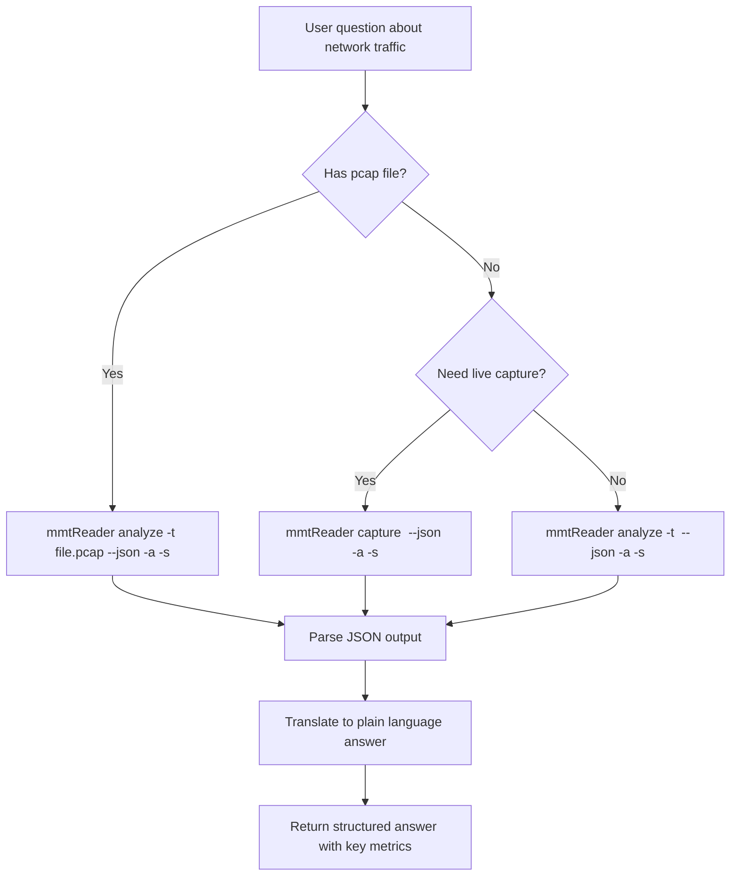

# mmtReader Skill

Analyze network traffic using mmtReader — a deep packet inspection CLI tool — and translate raw protocol statistics into clear, actionable answers.

## Prerequisites

mmtReader requires the MMT-DPI library at `/opt/mmt/dpi/` and system dependencies (libpcap, libconfuse). See **Installation** below.

## Installation

mmtReader requires the MMT-DPI library at `/opt/mmt/dpi/` and system dependencies (libpcap, libconfuse).

### Auto-detect and install

```bash
# Check if mmtReader is available
if ! command -v mmtReader &>/dev/null; then
  echo "mmtReader not found — attempting to locate source..."
fi

# Common locations to check
for dir in /home/montimage/workspace/mmt/mmt-reader ~/workspace/mmt/mmt-reader /opt/mmt/mmt-reader; do
  if [ -d "$dir" ] && [ -f "$dir/mmtReader" ]; then
    echo "Found mmtReader at $dir"
    cd "$dir"
    sudo ./install.sh --mmt-reader-only
    break
  fi
done

# Verify
mmtReader --version
```

### Manual install from source

```bash
cd /path/to/mmt-reader
sudo ./install.sh          # full install (deps + MMT-DPI + mmtReader)
# OR
sudo ./install.sh --mmt-reader-only   # mmtReader only (MMT-DPI must exist)
# OR
make build && sudo make install
```

### Verify

```bash
mmtReader --version
mmtReader analyze -h   # should show help without error
```

If the binary is not found after checking common locations, ask the user for the mmtReader source path or binary location.

## Core Workflow



## Command Reference

### Analyze a pcap file (offline)

```bash
mmtReader analyze -t <pcap-file> --json -a -s
```

- `-t` / `--trace` — path to pcap file (**required**)
- `--json` — machine-readable JSON output
- `-a` / `--proto-path` — show full protocol hierarchy (e.g., `TCP.HTTP.Google`)
- `-s` / `--sessions` — include per-protocol session counts

This is the **default and recommended** mode. Use `--json` so the output is structured and easy to parse.

### Capture live traffic (online)

```bash
sudo mmtReader capture <interface> --json -a -s
```

- Requires root privileges
- Press `Ctrl+C` to stop and print final statistics
- Supports Ethernet and WiFi interfaces

## Classification Flags

These hidden flags control how mmtReader identifies protocols:

| Flag | Meaning | Default | When to toggle |
|------|---------|---------|----------------|
| `-x <0|1>` | IP address classification | `1` | Disable for speed, accept less accuracy |
| `-y <0|1>` | Hostname (SNI) classification | `1` | Disable if SNI is encrypted/irrelevant |
| `-z <0|1>` | Port number classification | `1` | Disable for MMP-only mode |

To disable all classification (MMP-only mode): `-x 0 -y 0 -z 0`

## Output Format

### JSON (with `--json`)

The JSON output contains four sections:

```json
{
  "version": "1.8.0 (42cac8b7)",
  "input_stats": {
    "packets": 14261,
    "data_volume": 9216531,
    "duration_seconds": 298.0,
    "bandwidth_bytes_per_sec": 30926.5,
    "packets_per_sec": 47.86,
    "ipv4_sessions": 168,
    "ipv6_sessions": 0,
    "total_sessions": 168,
    "protocols": 28
  },
  "protocol_paths": [
    {
      "packets": 5287,
      "data_volume": 5967094,
      "payload_volume": 5681596,
      "path": "ethernet.ip.tcp.http"
    }
  ],
  "protocols": [
    {
      "name": "http",
      "packets": 5287,
      "data_volume": 5967094,
      "payload_volume": 5681596,
      "sessions": 0
    }
  ],
  "anomalies": []
}
```

Key fields to extract:
- **`input_stats.packets`** — total packets processed
- **`input_stats.total_sessions`** — combined IPv4 + IPv6 sessions
- **`input_stats.protocols`** — number of distinct protocols detected
- **`input_stats.duration_seconds`** — analysis window in seconds
- **`input_stats.bandwidth_bytes_per_sec`** — average bandwidth
- **`protocols[]`** — aggregated per-top-level-protocol stats (sorted by packets desc)
- **`protocol_paths[]`** — per-path breakdown (full DPI hierarchy)
- **`anomalies[]`** — detected anomalies (usually empty)

### Text (default)

Four sections are printed at the end of execution:
1. **Protocol statistics with path** (if `-a`) — per-path breakdown of packets, volume, and payload
2. **Protocol statistics (aggregated)** — per-protocol totals sorted by packet count
3. **Input statistics** — summary: packets, data volume, sessions, protocols, duration, bandwidth
4. **PCAP statistics** (online only) — received packets and kernel/driver drop counts

## Answering Questions

When the user asks about network traffic:

1. **Identify the pcap file** — ask for the path if not provided; check common locations (`*.pcap`, `*.cap`, `capture.pcap`, `smallFlows.pcap`)
2. **Run mmtReader** with `--json -a -s` for structured output
3. **Parse the JSON** to extract key metrics
4. **Translate to plain language** — convert raw numbers into actionable insights
5. **Handle errors gracefully** — if mmtReader fails, report the error and suggest fixes

### Error handling

| Error | Fix |
|-------|-----|
| `command not found: mmtReader` | Install from source (see Installation above) |
| `No such file or directory` | Verify pcap file path; ask user for correct path |
| `Couldn't open device` | Check interface name with `ip link show` |
| `is not an Ethernet` | Run with `sudo`; ensure interface is Ethernet-type |
| `MMT-DPI library not found` | MMT-DPI must be installed at `/opt/mmt/dpi/` |
| `Permission denied` | Run with `sudo` for live capture; verify file permissions for pcap analysis |

**Q: "What protocols are in this capture?"**

```bash
mmtReader analyze -t /path/to/capture.pcap --json -a -s
```

Then summarize: "The capture contains 14,261 packets over 298 seconds across 28 protocols. HTTP dominates with 5,287 packets (37% of traffic), followed by MSN at 3,735 packets (26%), SSL at 3,090 packets (22%), and Salesforce at 1,422 packets (10%)."

**Q: "Which service uses the most bandwidth?"**

```bash
mmtReader analyze -t /path/to/capture.pcap --json -a -s
```

Then summarize: "HTTP dominates at 5.97 MB total (5.68 MB payload), followed by MSN at 4.26 MB (4.06 MB payload), SSL at 2.77 MB (2.60 MB payload), and Salesforce at 1.43 MB (1.35 MB payload)."

**Q: "How many sessions are there?"**

```bash
mmtReader analyze -t /path/to/capture.pcap --json -a -s
```

Then summarize from `input_stats.total_sessions` and `ipv4_sessions`: "There are 168 total sessions (all IPv4). The protocols array shows session counts per protocol (note: per-protocol sessions may be 0 in some versions)."

## Mermaid Diagrams

For visual answers, convert protocol stats to a Mermaid pie or bar chart:


## Edge Cases

- **No pcap file provided**: Ask the user for the path or offer live capture
- **No mmtReader installed**: Attempt installation from source; if source unavailable, ask the user
- **Live capture needs root**: Use `sudo` and warn the user
- **Large pcap files**: Add `-q` (quiet) to suppress progress output
- **WiFi interfaces**: mmtReader auto-converts 802.11 frames to Ethernet format
- **IPv6 traffic**: Tracked alongside IPv4 in session counts

## Reference

For common question patterns and their corresponding commands, read `references/common-questions.md`.

## Limitations

- mmtReader classifies protocols via DPI; some encrypted or custom protocols may not be identified
- Live capture requires root privileges and an Ethernet/WiFi interface
- Session tracking (`-s`) only counts IPv4/IPv4 sessions, not individual flows
- The tool does not reconstruct payloads or extract application data beyond classification
