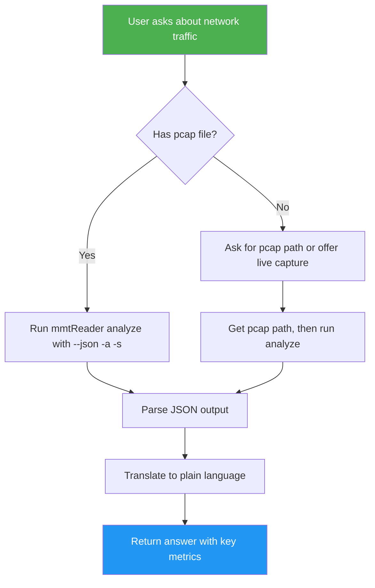

<!--
  DO NOT READ THIS FILE — This README.md is for human catalog browsing only.
  It ships inside the .skill package but is NEVER auto-loaded into agent context.
  The runtime loader only reads SKILL.md + references/ + scripts/ + agents/ when the skill triggers.
  If you're an AI agent, read the SKILL.md file instead for skill instructions.
-->

# mmtReader — Network Traffic Analysis

> Analyze network traffic and answer questions about pcap captures or live interfaces using mmtReader.

## Highlights

- **Offline pcap analysis** — analyze .pcap files for protocol statistics
- **Live traffic capture** — monitor real-time network interfaces (Ethernet + WiFi)
- **JSON output** — machine-readable structured data for automation pipelines
- **Protocol classification** — identify HTTP, DNS, TLS, ICMP, and more via MMT-DPI
- **Plain language answers** — raw stats translated into actionable insights

## When to Use

| Say this... | Skill will... |
|---|---|
| "What protocols are in this capture?" | Run mmtReader on the pcap file and summarize protocol distribution |
| "Which service uses the most bandwidth?" | Analyze traffic and report top protocols by data volume |
| "Analyze this .pcap file" | Execute mmtReader analyze and translate output into a clear report |
| "How much traffic is on port 443?" | Run classification-aware analysis and report port-based stats |

## How It Works



## Usage

```
/mmt-reader
```

Example prompt: "Analyze this pcap file at /path/to/capture.pcap and tell me which protocols dominate."

## Resources

| Path | Description |
|---|---|
| `references/` | Common question patterns and command mappings |
| `docs/` | Human-readable documentation (not auto-loaded) |

## Output

The skill produces a structured answer in plain language with:
- Protocol distribution (packet counts, data volumes)
- Session counts and bandwidth metrics
- Optional Mermaid diagrams for visual representation
