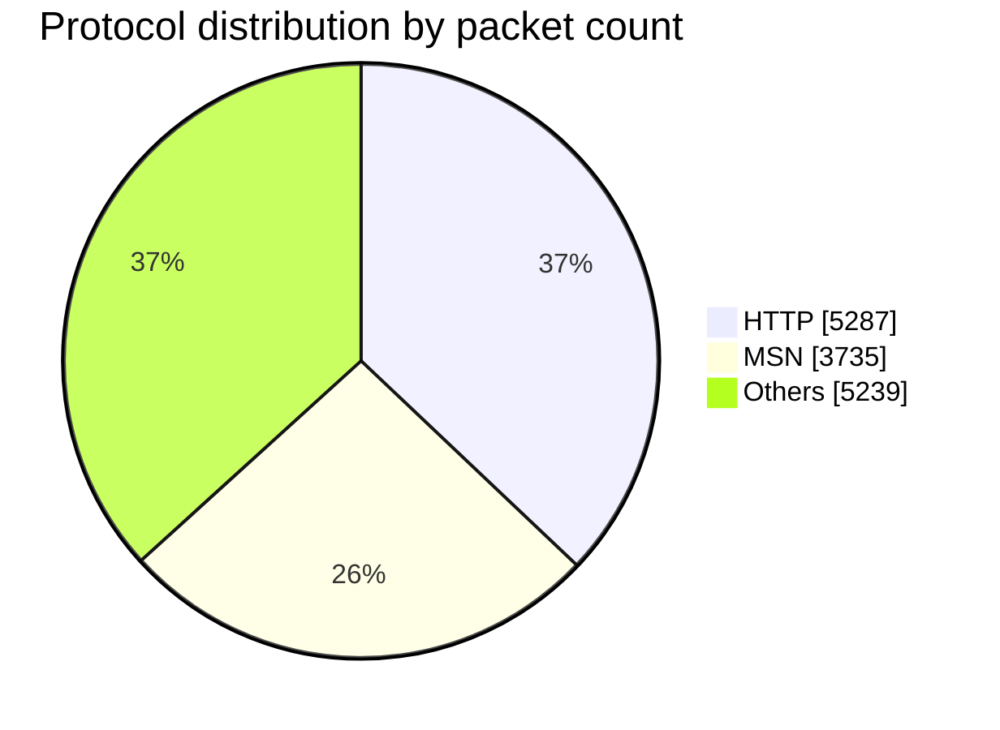

# mmtReader Skill

Analyze network traffic with mmtReader — a deep packet inspection CLI — and translate raw protocol statistics into clear, actionable answers.

## When to Use

Use this skill when the user:

- Asks what protocols, applications, or services appear in a `.pcap` / `.cap` file
- Asks about bandwidth, throughput, packet counts, session counts, or capture duration
- Wants a breakdown or chart of traffic composition
- Wants to see what is currently flowing over a network interface

Do **not** use this skill for packet injection, traffic generation, Wireshark-style GUI work, payload reconstruction, or non-network questions. mmtReader classifies traffic; it does not craft, replay, or decrypt it.

## The standard run

One invocation answers almost every question. Throughout this skill, **the standard run** means:

```bash
mmtReader analyze -t <pcap-file> --json -a -s
```

| Flag | Meaning |
|------|---------|
| `-t` / `--trace` | Path to the pcap file (**required**) |
| `--json` | Machine-readable JSON output — always use it, then parse |
| `-a` / `--proto-path` | Full protocol hierarchy (e.g. `ethernet.ip.tcp.http`) |
| `-s` / `--sessions` | Per-protocol session counts |

For live traffic, the equivalent is `sudo mmtReader capture <interface> --json -a -s`. Run one command and answer from its JSON — do not re-run with different flags hoping for a better shape.

## Instructions

Follow these steps in order.

1. **Confirm the binary exists.** Run `mmtReader --version`. If it exits non-zero, read `references/installation.md` and follow it; do not improvise an install.
2. **Resolve the input.** Take the pcap path from the user. If none was given, search the working directory for `*.pcap` / `*.cap` and offer what you find; if nothing matches, ask for the path. Never guess a path and never analyze a file the user did not name or confirm.
3. **Choose the mode.** A file path means offline analysis via **the standard run**. An interface name means live capture — before running it, get explicit confirmation, because it needs `sudo` and reads other people's traffic (see **Safety**).
4. **Run the command once**, capturing both stdout and the exit code.
5. **Verify the run succeeded** against the checkable bar below. If it fails, go to **Error handling** — do not report statistics from a failed run.
6. **Extract only the fields the question needs** from the JSON (see **Output Format**).
7. **Answer in plain language.** Lead with the direct answer, then the supporting numbers with units and percentages. Add a Mermaid chart when the user asks for a chart or a breakdown of more than four protocols.

### Checkable success bar

The run succeeded when **all three** hold:

- The process exited `0`
- stdout parses as JSON
- `input_stats.packets > 0`

Zero packets with exit `0` means the capture is empty or the filter matched nothing — say so explicitly rather than reporting "no traffic detected" as a finding about the network.

## Output Format

`--json` returns four sections: `input_stats`, `protocol_paths`, `protocols`, and `anomalies`. A full annotated sample lives in `references/json-output.md` — read it when you need a field this table does not cover.

| Field | Use it to answer |
|-------|------------------|
| `input_stats.packets` | Total packets processed |
| `input_stats.data_volume` | Total bytes in the capture |
| `input_stats.duration_seconds` | Length of the capture window |
| `input_stats.bandwidth_bytes_per_sec` | Average bandwidth — convert to KB/s or MB/s |
| `input_stats.total_sessions`, `.ipv4_sessions`, `.ipv6_sessions` | Session counts |
| `input_stats.protocols` | Count of distinct protocols detected |
| `protocols[]` | Per-protocol totals, sorted by packets descending — the usual source for "which service…" |
| `protocol_paths[]` | Full DPI hierarchy per path — use for "show me the stack" questions |
| `anomalies[]` | Detected anomalies; usually empty |

Without `--json`, mmtReader prints the same four sections as text at the end of the run, plus PCAP receive/drop counts for live captures. Prefer JSON.

## Example

**User:** "What protocols are in `smallFlows.pcap`?"

```bash
mmtReader analyze -t smallFlows.pcap --json -a -s
```

```json
{
  "input_stats": {
    "packets": 14261,
    "data_volume": 9216531,
    "duration_seconds": 298.0,
    "bandwidth_bytes_per_sec": 30926.5,
    "total_sessions": 168,
    "protocols": 28
  },
  "protocols": [
    { "name": "http", "packets": 5287, "data_volume": 5967094 },
    { "name": "msn",  "packets": 3735, "data_volume": 4264448 }
  ]
}
```

**Answer:** "The capture holds 14,261 packets over 298 seconds (9.2 MB, ~30 KB/s average) across 168 sessions and 28 protocols. HTTP dominates at 5,287 packets (37%, 5.97 MB), followed by MSN at 3,735 packets (26%, 4.26 MB)."

For a chart, convert `protocols[]` into a Mermaid pie:



More question-to-command mappings live in `references/common-questions.md`.

## Expected output

Every answer this skill produces must have all four parts. Check them before replying.

1. **A direct answer sentence** naming the specific protocol, number, or interface asked about.
2. **Supporting figures with units** — bytes rendered as KB/MB/GB, rates as KB/s or MB/s, shares as percentages of `input_stats.packets` or `.data_volume`.
3. **The command that produced them**, so the user can re-run it.
4. **Any limitation that changed the answer** — DPI misclassification, `sessions: 0`, empty `anomalies[]` — stated plainly, or omitted if none applied.

```
The capture holds 14,261 packets over 298 seconds (9.2 MB, ~30 KB/s average)
across 168 sessions and 28 protocols. HTTP dominates at 5,287 packets
(37%, 5.97 MB), followed by MSN at 3,735 packets (26%, 4.26 MB).

Produced by: mmtReader analyze -t smallFlows.pcap --json -a -s
Note: per-protocol session counts read 0 in this build, so the 168 sessions
are a capture-wide total only.
```

Do **not** reply with raw JSON, an unlabelled number, or a claim the run does not support. If the checkable success bar failed, report the error instead of an answer.

## Classification Flags

The hidden `-x` / `-y` / `-z` flags control IP, hostname, and port classification. All default to enabled, which gives the most accurate protocol names. Change them only when the user explicitly asks for speed or raw results — silently disabling classification yields answers that look complete but under-identify traffic. See `references/classification-flags.md` for the flag table and MMP-only mode.

## Safety

- **Live capture reads other people's traffic.** Before running `mmtReader capture`, confirm the user owns or is authorized to monitor the interface, and tell them capture is running. Never start a live capture speculatively or leave one running unattended.
- **`sudo` is required for live capture only.** Offline pcap analysis needs no elevation — never add `sudo` to an `analyze` command to work around a permissions error; fix the file permissions instead.
- **Captures are sensitive.** A pcap can contain credentials, hostnames, and personal data. Report aggregate statistics; quote raw packet contents only when the user asks. Do not copy pcap files or their contents to any external service.
- **Never modify the capture.** This skill only reads. Do not delete, truncate, or rewrite a pcap, and do not run `install.sh`, `make install`, or any `sudo` command without showing it to the user first.

## Error handling

Map the failure to its fix, then retry once at most. If the same error recurs, report the exact stderr to the user instead of trying further variations.

| Error | Fix |
|-------|-----|
| `command not found: mmtReader` | Follow `references/installation.md` |
| `MMT-DPI library not found` | MMT-DPI is missing from `/opt/mmt/dpi/` — see `references/installation.md` |
| `No such file or directory` | Verify the pcap path; ask the user rather than guessing |
| `Permission denied` (analyze) | Check read permission on the pcap — do **not** escalate to `sudo` |
| `Couldn't open device` | List valid interfaces with `ip link show` and confirm the name |
| `is not an Ethernet` | Interface is not Ethernet-type, or the command needs `sudo` |

## Edge Cases

- **Large pcap files** — add `-q` to suppress per-packet progress output.
- **WiFi interfaces** — mmtReader auto-converts 802.11 frames to Ethernet format; no extra flags needed.
- **IPv6 traffic** — counted alongside IPv4 in `total_sessions`; report `ipv6_sessions` separately when it is non-zero.
- **Per-protocol `sessions` reads 0** — some versions do not populate it; fall back to `input_stats.total_sessions` and say the per-protocol split is unavailable.
- **Live capture** — press `Ctrl+C` to stop; final statistics print on exit, so never kill the process with `SIGKILL`.

## Limitations

State these when they affect the answer:

- Classification is DPI-based — encrypted or custom protocols may be unidentified or misattributed.
- Session tracking counts IPv4/IPv6 sessions, not individual flows.
- mmtReader does not reconstruct payloads or extract application data beyond classification.
- Live capture requires root and an Ethernet or WiFi interface.

## References

- `references/installation.md` — install and verify mmtReader when the binary is missing
- `references/json-output.md` — annotated full JSON output sample
- `references/classification-flags.md` — `-x` / `-y` / `-z` flags and MMP-only mode
- `references/common-questions.md` — question-to-command mappings
