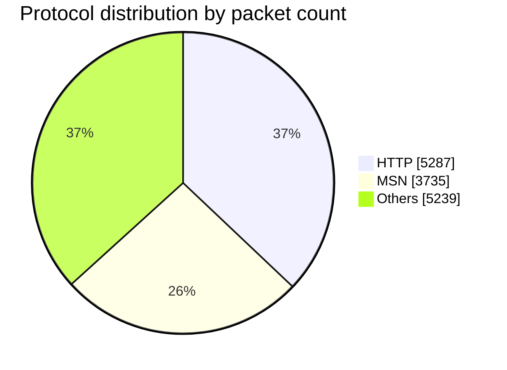

# mmtReader Skill

Analyze network traffic with mmtReader — a deep packet inspection CLI — and translate raw protocol statistics into clear, actionable answers.

## When to Use

Use this skill when the user:

- Asks what protocols, applications, or services appear in a `.pcap` / `.cap` file
- Asks about bandwidth, throughput, packet counts, session counts, or capture duration
- Wants a breakdown or chart of traffic composition
- Wants to see what is currently flowing over a network interface

Do **not** use this skill for packet injection, traffic generation, Wireshark-style GUI work, payload reconstruction, or non-network questions. mmtReader classifies traffic; it does not craft, replay, or decrypt it.

## The standard run

One invocation answers almost every question. Throughout this skill, **the standard run** means:

```bash
mmtReader analyze -t <pcap-file> --json -a -s
```

| Flag | Meaning |
|------|---------|
| `-t` / `--trace` | Path to the pcap file (**required**) |
| `--json` | Machine-readable JSON output — always use it, then parse |
| `-a` / `--proto-path` | Adds the `protocol_paths[]` section — the full DPI hierarchy per path. Without it that key is absent; `protocols[]` is populated either way |
| `-s` / `--sessions` | Adds the per-IP-version and active session counts to `input_stats`, and `sessions` to each `protocols[]` entry |

For live traffic, **the live run**:

```bash
mmtReader capture <interface> -a -s --json
```

Under `--json` everything that is not the document — banner, `INFO:` lines, the `-F` flow table — goes to stderr, so stdout is a single JSON document with or without `-q`. Adding `-q` only silences the `INFO:` chatter. Live capture needs root, or `cap_net_raw` as granted by `install.sh`. Stop with `Ctrl+C`.

Run one command and answer from its JSON — do not re-run with different flags hoping for a better shape.

## Instructions

Follow these steps in order.

1. **Confirm the binary exists.** Run `mmtReader --version`. If it exits non-zero, read `references/installation.md` and follow it; do not improvise an install.
2. **Resolve the input.** Take the pcap path from the user. If none was given, search the working directory for `*.pcap` / `*.cap` and offer what you find; if nothing matches, ask for the path. Never guess a path and never analyze a file the user did not name or confirm.
3. **Choose the mode.** A file path means offline analysis via **the standard run**; an interface name means **the live run**. Get explicit confirmation before any live capture — it reads other people's traffic (see **Safety**).
4. **Run the command once**, capturing both stdout and the exit code.
5. **Verify the run succeeded** against the checkable bar below. If it fails, go to **Error handling** — do not report statistics from a failed run.
6. **Extract only the fields the question needs** from the JSON (see **Output Format**).
7. **Answer in plain language.** Lead with the direct answer, then the supporting numbers with units and percentages. Add a Mermaid chart when the user asks for a chart or a breakdown of more than four protocols.

### Checkable success bar

The run succeeded when **all three** hold:

- The process exited `0`
- stdout parses as JSON
- `input_stats.packets > 0`, on offline and live runs alike — live captures are accounted through the same engine as `analyze`, so a `0` there means the interface really saw nothing.

Failing the bar with exit `0` means the capture is empty or matched nothing — say so explicitly rather than reporting "no traffic detected" as a finding about the network.

## Output Format

`--json` returns four sections: `input_stats`, `protocol_paths`, `protocols`, and `anomalies`. A full annotated sample lives in `references/json-output.md` — read it when you need a field this table does not cover.

| Field | Use it to answer |
|-------|------------------|
| `input_stats.packets` | Total packets processed |
| `input_stats.data_volume` | Total bytes on the wire |
| `input_stats.duration_seconds` | Length of the capture window |
| `input_stats.packets_per_sec`, `.bandwidth_bytes_per_sec` | Average packet and byte rates |
| `input_stats.protocols` | Number of distinct protocols seen |
| `input_stats.total_sessions`, `.ipv4_sessions`, `.ipv6_sessions` | Sessions seen over the whole capture |
| `input_stats.active_sessions` | Sessions still open when the run ended (`-s` only) |
| `protocols[]` | Per-protocol totals, sorted by packets descending — the usual source for "which service…" |
| `protocol_paths[]` | Full DPI hierarchy per path — use for "show me the stack" questions |
| `anomalies[]` | Detected anomalies; usually empty |

### Read the totals, do not recompute them

Every `input_stats` figure comes from MMT-DPI's own accounting, so quote them directly — earlier releases zeroed `data_volume`, `bandwidth_bytes_per_sec` and `protocols`, and any workaround that derives them from the `ethernet` entry now just duplicates the same number. One distinction still matters: `total_sessions` counts every session seen, `active_sessions` only those still open at the end. See `references/json-output.md` for the field-by-field notes.

Without `--json`, mmtReader prints the same four sections as text, plus PCAP drop counts for live captures. Prefer JSON.

## Example

**User:** "What protocols are in `smallFlows.pcap`?"

```bash
mmtReader analyze -t smallFlows.pcap --json -a -s
```

Real output, abridged:

```json
{ "input_stats": { "packets": 14261, "data_volume": 9216531, "duration_seconds": 298.51,
                   "bandwidth_bytes_per_sec": 30875.60, "total_sessions": 679,
                   "active_sessions": 168, "protocols": 28 },
  "protocols": [ { "name": "ethernet", "packets": 14261, "data_volume": 9216531 },
                 { "name": "http",     "packets": 5287,  "data_volume": 5967094 },
                 { "name": "msn",      "packets": 3735,  "data_volume": 4259140 } ] }
```

**Answer:** "The capture holds 14,261 packets over 299 seconds (9.2 MB, ~30.9 KB/s average) across 679 sessions and 28 protocols. HTTP dominates at 5,287 packets (37%, 5.97 MB), followed by MSN at 3,735 packets (26%, 4.26 MB)."

For a chart, convert `protocols[]` into a Mermaid pie:



More question-to-command mappings live in `references/common-questions.md`.

## Expected output

Every answer this skill produces must have all four parts. Check them before replying.

1. **A direct answer sentence** naming the specific protocol, number, or interface asked about.
2. **Supporting figures with units** — bytes rendered as KB/MB/GB, rates as KB/s or MB/s, shares as percentages of `input_stats.packets` or `input_stats.data_volume`.
3. **The command that produced them**, so the user can re-run it.
4. **Any limitation that changed the answer** — DPI misclassification, `sessions: 0`, an empty `protocols[]` — stated plainly, or omitted if none applied.

```
The capture holds 14,261 packets over 299 seconds (9.2 MB, ~30.9 KB/s
average) across 679 sessions and 28 protocols. HTTP dominates at 5,287
packets (37%, 5.97 MB), followed by MSN at 3,735 (26%, 4.26 MB).

Produced by: mmtReader analyze -t smallFlows.pcap --json -a -s
Note: only the `ip`/`ipv6` entries carry a session count, so 679 is the capture-wide total.
```

Do **not** reply with raw JSON, an unlabelled number, or a claim the run does not support. If the checkable success bar failed, report the error instead of an answer.

## Classification Flags

The hidden `-x` / `-y` / `-z` flags control IP, hostname, and port classification. All default to enabled, which gives the most accurate protocol names. Change them only when the user explicitly asks for speed or raw results — silently disabling classification yields answers that look complete but under-identify traffic. See `references/classification-flags.md` for the flag table and MMP-only mode.

## Safety

- **Live capture reads other people's traffic.** Before running `mmtReader capture`, confirm the user owns or is authorized to monitor the interface, and tell them capture is running. Never start a live capture speculatively or leave one running unattended.
- **`sudo` is required for live capture only.** Offline pcap analysis needs no elevation — never add `sudo` to an `analyze` command to work around a permissions error; fix the file permissions instead.
- **Captures are sensitive.** A pcap can contain credentials, hostnames, and personal data. Report aggregate statistics; quote raw packet contents only when the user asks. Do not copy pcap files or their contents to any external service.
- **Never modify the capture.** This skill only reads. Do not delete, truncate, or rewrite a pcap, and do not run `install.sh`, `make install`, or any `sudo` command without showing it to the user first.
- **Bound every live capture.** Use `-F <seconds>`, which exits on its own, rather than an open-ended run you have to remember to stop.

## Error handling

Retry **once** at most; if it recurs, report the exact stderr rather than trying more variations. Exit codes: `0` success, `1` capture failure, `2` usage or input error. Read `references/troubleshooting.md` whenever a run fails the success bar — it holds the error table and the edge cases (large files, WiFi, IPv6, `-F` captures, empty `protocols[]`).

## Limitations

State these when they affect the answer:

- Classification is DPI-based — encrypted or custom protocols may be unidentified or misattributed.
- Session counts are per IPv4/IPv6, not per flow. Use `-F` for per-flow data: it lists the DPI's sessions, each with its application protocol, client and server endpoints, bytes and packets.
- mmtReader classifies only; it does not reconstruct payloads.

## References

- `references/installation.md` — install and verify mmtReader when the binary is missing
- `references/json-output.md` — annotated full JSON output sample
- `references/classification-flags.md` — `-x` / `-y` / `-z` flags and MMP-only mode
- `references/troubleshooting.md` — error table, exit codes, and edge cases
- `references/common-questions.md` — question-to-command mappings
